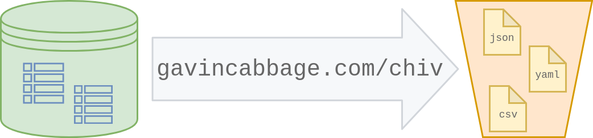

---

<p align="center">
    Archive relational data to Amazon S3.
</p>

<div align="center">
    <a href="https://github.com/gavincabbage/chiv/actions?workflow=build">
        
    </a>
    <a href="https://goreportcard.com/report/gavincabbage.com/chiv">
        
    </a>
    <a href="https://godoc.org/gavincabbage.com/chiv">
        
    </a>
    <a href="https://gavincabbage.com/chiv/blob/master/LICENSE">
        
    </a>
</div>

---

This project provides the `chiv` package and a simple CLI wrapper of the same name. It requires Go 1.13.

Use `chiv` to download relational data from a database and format it before uploading to Amazon S3.
Built-in formats include CSV, YAML and JSON. 
Custom formats are also supported through the `Formatter` interface.

# Getting Started

```go
import "gavincabbage.com/chiv"
```

Provide a database and upload manager to upload a table to an S3 bucket in the default CSV format.

```go
db, _ := sql.Open(config.driver, config.url)

client := s3.New(session.NewSessionWithOptions(session.Options{}))
uploader := s3manager.NewUploaderWithClient(client)

chiv.Archive(db, uploader, "table", "bucket")
``` 

Use [options](https://github.com/gavincabbage/chiv/blob/master/options.go) to configure the archival format,
upload key, null placeholder, etc.

```go
chiv.Archive(db, uploader, "table", "bucket"
    chiv.WithFormat(chiv.JSON),
    chiv.WithKey("2019/september/monthly_archive.json"),
    chiv.WithNull("empty"),
)
```

For multiple uploads using the same database and S3 clients, construct an `Archiver`. Options provided during
construction of an `Archiver` can be overridden in individual archival calls.

```go
a := chiv.NewArchiver(db, uploader, chiv.WithFormat(chiv.YAML))
a.Archive("first_table", "bucket")
a.Archive("second_table", "bucket")
a.Archive("second_table", "bucket", chiv.WithFormat(chiv.JSON), chiv.WithKey("second_table.json"))
``` 

Custom queries can be archived using the `ArchiveRows` family of functions.

```go
rows, _ := db.Exec("SELECT * FROM table and JOIN all the things...")

chiv.ArchiveRows(rows, uploader, "bucket")
``` 

Context-aware versions are also provided, e.g. `ArchiveWithContext`, `ArchiveRowsWithContext`, etc.

See the [unit](https://github.com/gavincabbage/chiv/blob/master/chiv_test.go)
and [integration](https://github.com/gavincabbage/chiv/blob/master/chiv_integration_test.go)
tests for additional examples.

# Custom Formats

Custom formats can be used by implementing the `FormatterFunc` and `Formatter` interfaces.
The optional `Extensioner` interface can be implemented to allow a `Formatter` to provide a default extension.

See the three [built-in formats](https://github.com/gavincabbage/chiv/blob/master/chiv_formatters.go)
for examples.

# CLI

A simple CLI wrapping the package is also included.

```text
NAME:
   chiv - Archive relational data to Amazon S3

USAGE:
   chiv [flags...]

VERSION:
   vX.Y.Z

GLOBAL OPTIONS:
   --database value, -d value   database connection string [$DATABASE_URL]
   --table value, -t value      database table to archive
   --bucket value, -b value     upload S3 bucket name
   --driver value, -r value     database driver type: postgres or mysql (default: "postgres")
   --columns value, -c value    database columns to archive, comma-separated
   --format value, -f value     upload format: csv, yaml or json (default: "csv")
   --key value, -k value        upload key
   --extension value, -e value  upload extension
   --null value, -n value       upload null value
   --help, -h                   show usage details
   --version, -v                print the version
```

# Design

This package ties together three components of what is essentially an ETL operation:

- **Extract** database rows with a `Database` or `Rows`
  - `Database` may be a `*sql.DB`, `*sql.Conn`, `*sql.Tx`, etc.
- **Transform** data into an upload format with a `Formatter`
- **Load** the formatted data into S3 with a `Uploader`
  - `Uploader` is typically an `*s3manager.Uploader`
  
An `io.Pipe` is used to guarantee a cap on total memory usage by `chiv` itself.
A [benchmark](https://github.com/gavincabbage/chiv/blob/master/chiv_benchmark_test.go)
is provided to profile the package's memory usage.
Total memory usage of the archival process can be further controlled by 
configuring the S3 upload manager.


# Testing & Development

Tests are segregated by build tags.

Run unit tests:

```bash
go test -tags=unit ./...
```

Use docker-compose to run the full suite of unit and integration tests:

```bash
docker-compose up --exit-code-from test --build
```

Run benchmarks:

```bash
go test -v -p 1 -tags=benchmark,unit -run=Benchmark -benchmem -bench=.
```

This project uses GitHub Actions for CI. 
Linting, unit tests, integration tests and benchmarks are run for each push or pull request.

Tagged releases are built automatically by [GoReleaser](https://goreleaser.com/).

# Contributing

Contributions in the form of comments, issues or pull requests are very welcome.
If you use this package I would love to hear from you!
